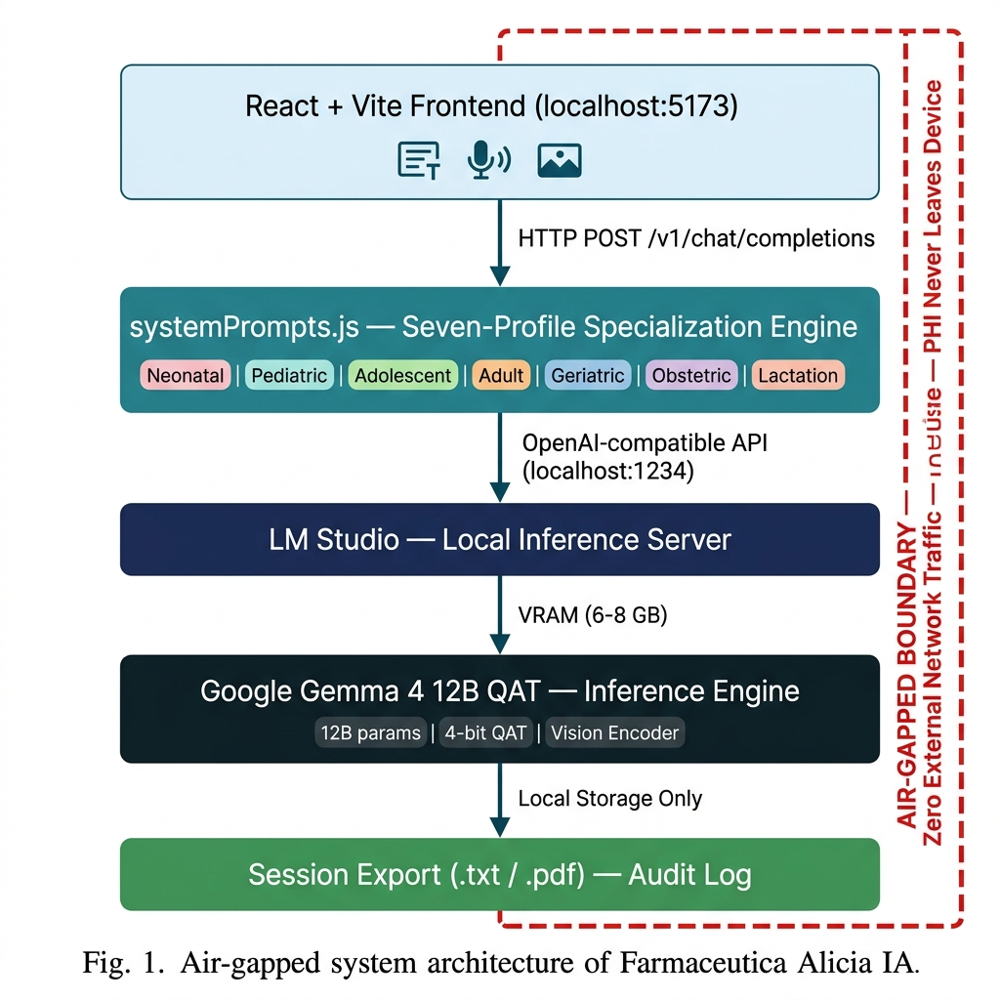

# Farmacéutica Alicia IA 👩‍⚕️💊

**A Privacy-First, Air-Gapped Multimodal Clinical Pharmacist Agent with Seven-Profile Specialization on Commodity Hardware**

## Overview
This repository contains the source code, prompts, and clinical validation dataset for **Alicia IA**, an air-gapped clinical decision-support agent designed for pharmacovigilance. 

Built to address the three major barriers of cloud-based LLMs in healthcare (connectivity, recurring costs, and PHI privacy), Alicia IA runs entirely locally on commodity hardware using **Google Gemma 4 12B QAT** interfaced through a React+Vite frontend and LM Studio.

The system utilizes a **Seven-Profile Pharmacological Specialization Engine** that steers the model into distinct clinical modes (Neonatal, Pediatric, Adolescent, General Adult, Geriatric, Obstetric, Lactation) using evidence-based criteria (Beers 2023, STOPP/START, LactMed, etc.).

## Authors
- **Mtro. Luis Ramón Tercero Martínez González**
- **Dra. María Teresa Flores Dorantes**
*Laboratorio de Biología Molecular y Farmacogenética (LBMyFG) - UJAT, México.*

## Data Availability
To support reproducibility and transparent academic review (CONSORT-AI), this repository includes:
1. **`dataset_8_casos_adulto_general.md`**: The structured clinical dataset of 8 scenarios focusing on the General Adult profile, used for the preliminary validation.
2. **`dataset_56_casos_clinicos.md`**: The complete theoretical dataset of 56 scenarios across 7 profiles, slated for Future Work.
3. **`systemPrompts.js`**: The exact system prompts and rulesets used to enforce the clinical behaviors and safety guardrails (ISO/IEC 42001).

## System Requirements & Hardware Limitations
- **Recommended Hardware**: 16 GB VRAM minimum for optimal generation speed.
- **Experimental Hardware (Used for this study)**: Intel Core / Ryzen, 16 GB RAM, 6 GB VRAM.
  - *Note on Inference Latency*: Due to the hardware constraints (6 GB VRAM vs the recommended 16 GB), the 12 Billion parameter model `google/gemma-4-12b-qat` is partially offloaded to CPU RAM. This results in reasoning times of approximately 75-100 seconds per query, with a token generation speed of ~7.5 tokens/second. This demonstrates that the system *can* operate on extreme commodity hardware, albeit with increased latency.
- **Backend**: [LM Studio](https://lmstudio.ai/) running `google/gemma-4-12b-qat` on port 1234.
- **Frontend**: Node.js v18+.

## Quick Start
1. Clone the repository: `git clone https://github.com/TerceroMaster/alicia-ia-smade2026.git`
2. Install dependencies: `npm install`
3. Start the UI: `npm run dev`
4. Ensure LM Studio server is running locally before submitting queries.

## Core Architectural Concepts
- **Single-Agent with Prompt-Driven Routing**: Unlike Multi-Agent Systems where multiple AI models converse with each other, Alicia IA uses a single LLM backend. The React frontend dynamically swaps the active *system prompt* based on the selected demographic profile, effectively changing the AI's "persona" and medical ruleset on the fly.
- **Privacy-First**: Designed to never transmit Protected Health Information (PHI) over the internet, addressing major HIPAA and NOM-024-SSA3-2010 compliance roadblocks present in cloud-based LLMs like ChatGPT.
- **Air-Gapped**: The system operates entirely offline without an active network connection, allowing deployment in remote clinics or high-security hospital networks.
- **Commodity Hardware**: Proves that frontier-level quantized AI models (12B parameters) can run efficiently on standard consumer-grade GPUs, eliminating the need for expensive cloud infrastructure.
- **ISO/IEC 42001 Governance & Anti-Jailbreaking**: We actively structured the entire development lifecycle around the ISO/IEC 42001:2023 guidelines. The system incorporates hardcoded semantic guardrails to defeat "Do Anything Now" (DAN) prompts, prevent knowledge leakage, and block image-based prompt injections.

## Preliminary Results (First Article Version)
We conducted initial testing exclusively on the **General Adult (18-64 years)** profile, evaluating 8 distinct clinical scenarios involving polypharmacy, CYP450 interactions, and prescribing cascades.
- **100% Detection Rate**: The system successfully identified the hidden Drug-Related Problems (DRP) in all 8 cases and prevented Negative Medication Outcomes (NMO), achieving a 100% clinically acceptable recommendation rate.
- **Reasoning Process**: The model successfully adhered to the `Chain-of-Thought` constraints, evaluating the mechanism of action before providing the recommendation. We render this reasoning inside a collapsible UI panel to ensure maximum transparency (CONSORT-AI guidelines).

## Future Work
Subsequent research will expand the validation to the remaining 6 pharmacological profiles (Neonatal, Pediatric, Adolescent, Geriatric, Obstetric, and Lactation) using the full 56-case dataset to evaluate the AI's adaptability to specialized pediatric posology, teratogenic risks, and Beers criteria.

## License
Open-source academic license. 

*Presented at SMaDE 2026 — Symposium on Mathematics applied to Data Engineering.*
