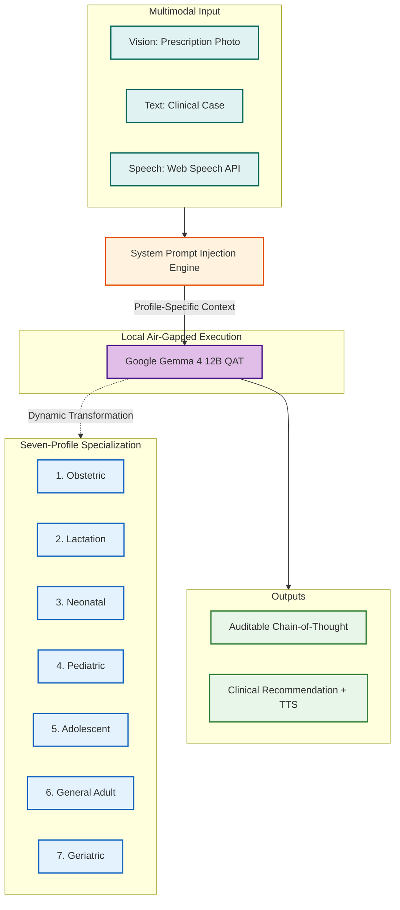

# AlicIA Pharmaceutical 👩‍⚕️💊

**A Privacy-First, Air-Gapped Multimodal Clinical Pharmacist Multi-Profile Agent on Commodity Hardware**


```mermaid
graph TD
    subgraph Inputs ["Multimodal Input"]
        V[Vision: Prescription Photo]
        T[Text: Clinical Case]
        S[Speech: Web Speech API]
    end

    PI[System Prompt Injection Engine]
    
    subgraph Core ["Local Air-Gapped Execution"]
        Gemma[Google Gemma 4 12B QAT]
    end

    subgraph Profiles ["Seven-Profile Specialization"]
        P1[1. Obstetric]
        P2[2. Lactation]
        P3[3. Neonatal]
        P4[4. Pediatric]
        P5[5. Adolescent]
        P6[6. General Adult]
        P7[7. Geriatric]
    end

    subgraph Outputs ["Outputs"]
        CoT[Auditable Chain-of-Thought]
        TTS[Clinical Recommendation + TTS]
    end

    Inputs --> PI
    PI -- "Profile-Specific Context" --> Gemma
    Gemma -. "Dynamic Transformation" .-> Profiles
    Gemma --> Outputs

    classDef core fill:#e1bee7,stroke:#4a148c,stroke-width:2px;
    classDef input fill:#e0f2f1,stroke:#00695c,stroke-width:2px;
    classDef profile fill:#e3f2fd,stroke:#1565c0,stroke-width:2px;
    classDef output fill:#e8f5e9,stroke:#2e7d32,stroke-width:2px;
    classDef engine fill:#fff3e0,stroke:#e65100,stroke-width:2px;

    class Gemma core;
    class V,T,S input;
    class P1,P2,P3,P4,P5,P6,P7 profile;
    class CoT,TTS output;
    class PI engine;
```

---

## 🎯 Quick Guide for Reviewers & Visitors

Welcome! If you are a reviewer, researcher, or visitor, we have organized the repository to help you quickly find what you need. Please follow these quick links:

*   **[📝 Response to Reviewers](respuesta_revisores.md)**: Detailed point-by-point responses to the peer-review feedback, including structural and methodological clarifications.
*   **[🎥 Video Demonstration](https://github.com/TerceroMaster/alicia-ia-smade2026)** *(Link to video file in repository)*: See the system in action.
*   **[📄 English Conference Paper (ISCS)](articulo_congreso_ISCS.tex)**: The LaTeX source code for the English manuscript.
*   **[📄 Spanish General Article](articulo_cientifico.tex)**: The expanded Spanish technical and scientific documentation.
*   **[🛡️ Defense Guide](defensa_congreso_SMaDE.md)**: Core concepts and arguments for the SMaDE congress defense.

---

## 📖 Overview

**AlicIA Pharmaceutical** is a locally-executed, air-gapped clinical decision-support agent designed for pharmacovigilance. It addresses the three major barriers of cloud-based LLMs in healthcare: mandatory internet connectivity, recurring subscription costs, and Protected Health Information (PHI) privacy.

The system runs entirely locally on commodity hardware using **Google Gemma 4 12B QAT** interfaced through a React+Vite frontend and LM Studio. It features a **Seven-Profile Pharmacological Specialization Engine** that steers the model into distinct clinical modes (Neonatal, Pediatric, Adolescent, General Adult, Geriatric, Obstetric, Lactation) using evidence-based criteria.

---

## 🎥 Video Demonstration vs. Public URL

**Why is there no live URL to test the system?**
The core premise of AlicIA Pharmaceutical is being **Privacy-First and Air-Gapped**. Deploying this software on a public cloud server (like AWS or Vercel) would require transmitting medical data over the internet, which fundamentally violates our strict compliance with **HIPAA** and the Mexican **NOM-024** regulations for PHI. 

To ensure reviewers and readers can evaluate the system's functionality without compromising this critical architectural design, we have provided a **full video demonstration** in the root of this repository.

---

## 🧠 Core Architectural Concepts

*   **Multi-Profile Agent (Prompt-Driven Routing)**: AlicIA operates as a *Single-Agent with Prompt-Driven Routing*. We use a single LLM backend (Gemma 4 12B). The React frontend dynamically swaps the active *system prompt* based on the selected demographic profile, effectively changing the AI's "persona" and medical ruleset on the fly.
*   **Privacy-First & Air-Gapped**: Designed to never transmit PHI over the internet. The system operates entirely offline without an active network connection, allowing deployment in remote clinics or high-security hospital networks.
*   **Commodity Hardware**: Proves that frontier-level quantized AI models can run efficiently on standard consumer-grade GPUs (e.g., 6 GB VRAM), eliminating the need for expensive cloud infrastructure.
*   **ISO/IEC 42001 Governance**: The system incorporates hardcoded semantic guardrails to defeat "Do Anything Now" (DAN) prompts, prevent knowledge leakage, and block image-based prompt injections.
*   **Multimodal Capabilities**: Includes Vision (for prescription reading), native Web Speech API (dictation), and OS-level Text-to-Speech, all without external API calls.
*   **Streamlined Clinical UI**: Features a persistent floating menu with 8 quick-access buttons (AI Engine Settings, Project Documentation, User Manual, LM Studio Technical Guide, Clinical Audit, Scientific Impact, ISO 42001 Cybersecurity, and Alicia 2.0), allowing healthcare professionals to access critical resources without leaving the active session.

---

## 📊 Data Availability & Reproducibility

To support reproducibility and transparent academic review (CONSORT-AI), we provide:

1.  **`dataset_8_casos_adulto_general.md`**: The structured clinical dataset of 8 scenarios used for preliminary validation.
2.  **`dataset_56_casos_clinicos.md`**: The complete theoretical dataset of 56 scenarios across 7 profiles.
3.  **`systemPrompts.js`**: The exact system prompts and rulesets (inside `src/`).
4.  **`resultados/`**: Contains the raw evaluation scores provided by the expert clinical pharmacist and the Python scripts used to generate the final charts.

---

## 💻 Quick Start Guide

If you wish to run the system locally on your own machine (requires an NVIDIA GPU or sufficient CPU RAM):

1.  **Install LM Studio**: Download and install [LM Studio](https://lmstudio.ai/).
2.  **Download the Model**: Search for `google/gemma-4-12b-qat` (Q4_K_M variant) in LM Studio.
3.  **Start the Local Server**: Load the model and start the local inference server on **port 1234**.
4.  **Clone this Repository**:
    ```bash
    git clone https://github.com/TerceroMaster/alicia-ia-smade2026.git
    cd alicia-ia-smade2026
    ```
5.  **Install Frontend Dependencies**:
    ```bash
    npm install
    ```
6.  **Run the UI**:
    ```bash
    npm run dev
    ```
7.  **Access**: Open `http://localhost:5173` in your browser (use Microsoft Edge or Firefox for fully local Voice-to-Text).

---

## 🔬 Authors & License

*   **Mtro. Luis Ramón Tercero Martínez González** *División Académica de Ciencias y Tecnologías de la Información - UJAT, México.*
*   **Dra. María Teresa Flores Dorantes** *Laboratorio de Biología Molecular y Farmacogenética (LBMyFG) - UJAT, México.*
*   **José Adán Hernández Nolasco** *(Corresponding Author: adam.hernandez@ujat.mx) División Académica de Ciencias y Tecnologías de la Información - UJAT, México.*

**License**: Open-source academic license. 

*Presented at SMaDE 2026 — Symposium on Mathematics applied to Data Engineering.*
